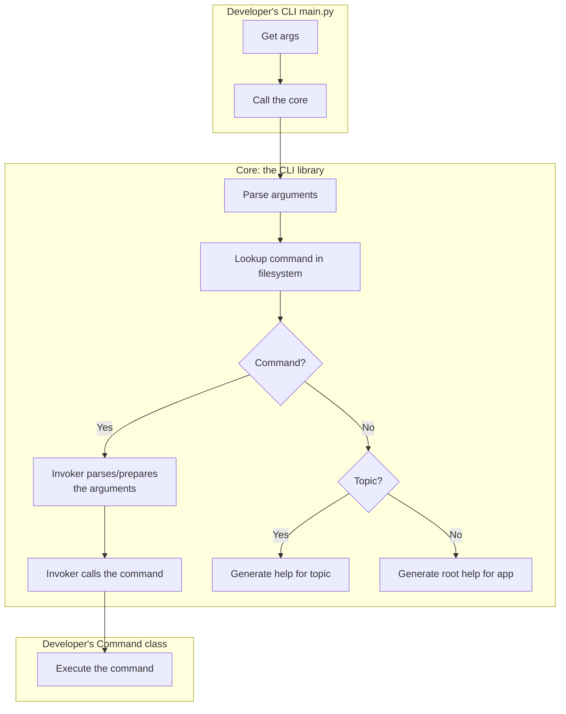

Classes:

- [x] BaseCommand Class (Protocol): to allow creation of Command classes
- [ ] Invoker Class: helps with calling (executing) the commands
- [ ] Controller (?): to initialize, find the Command classes, instantiate them and save them in a dictionary

C-->D[Invoker.parse\n Parse args]
Invoker.run\n Call the Command.run method
B[Controller.init \n Instantiate commands and store them in a dictionary]
D-->E[Invoker.find\n Find the command]
    
    
    G-->I[Command.run\n Execute the command]